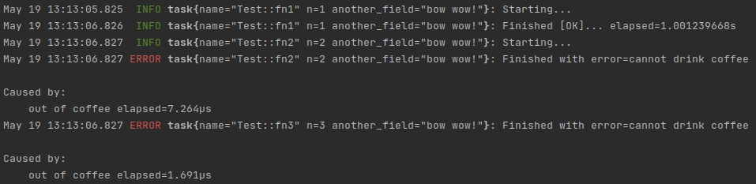

# tracing-tools - tiny lib for easier integration with tracing

Right now [tracing](https://github.com/tokio-rs/tracing) is a bit unusable with async code, because recommended way to instrument `async` code is by using `#instrument` macro which
 - does not support error formatting(very painful when using together with crates such as anyhow as it will swallow error chain)
 - has very tiresome syntax for skipping fields and by default tries to expose all of them which is completely pointless in 95% of my use cases

So this tiny crate tries to resolve those issues by switching to direct code instrumentation, example:



```rust
use anyhow::{anyhow, Context};
use tracing::{Level};
use tracing_tools::{span, TracingTask, PinnedFut};
use tokio::time::{sleep, Duration};

type Result<T> = anyhow::Result<T>;

struct Test {
}

impl Test {
    fn drink_coffee(&self, ) -> Result<()> {
        Err(anyhow!("out of coffee"))
    }

    fn fn1(&self, n: usize) -> PinnedFut<'_> {
        TracingTask::new(span!(Level::INFO, n=n, another_field="bow wow!"), async move {
            sleep(Duration::from_secs(1)).await;
            Ok(())
        }).instrument()
    }
    fn fn2(&self, n: usize) -> PinnedFut<'_> {
        TracingTask::new(span!(Level::INFO, n=n, another_field="bow wow!"), async move {
            Ok(self.drink_coffee().context("cannot drink coffee")?)
        }).instrument()
    }
    fn fn3(& self, n: usize) -> PinnedFut<'_> {
        TracingTask::new_short_lived(span!(Level::INFO, n=n, another_field="bow wow!"), async move {
            Ok(self.drink_coffee().context("cannot drink coffee")?)
        }).instrument()
    }
}

fn configure_tracing() -> Result<()>{
    let collector = tracing_subscriber::fmt()
        .with_target(false)
        .with_max_level(Level::INFO)
        .finish();
    tracing::subscriber::set_global_default(collector)?;
    Ok(())
}

#[tokio::main]
async fn main() -> Result<()> {
    configure_tracing()?;
    let s = Test {};
    let _ = s.fn1(1).await;
    let _ = s.fn2(2).await;
    let _ = s.fn3(3).await;
    Ok(())
}
```

Feel free to fork ;)
